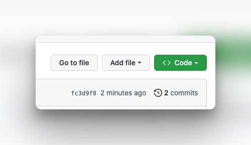

# JavaScript Conditionals Lab Exercises

In this homework assignment, you are going practice the basics of writing conditional statements using JavaScript as a programming language by completing problems that will challenge you knowledge of core princples. 

## Objectives 

- if/else if/else statement syntax
- Condition expressions
- Comparison operators
- Combining conditions with logical operators


## Instructions 

- **Fork** this repo to your account by cliking on the **fork** Button on the top of the page. 


*A **fork** is a copy of this repository and will appear on your github account.*

- Find the repository on *YOUR* account (ie yourUserName/js-lab-conditionals) and click on the green `Code` button at the top of the page.



- Copy the path in the dialoge box
- Navigate to a location on your local computer in VSCode where you keep your homework 
- Clone this repsository by typing the following command in your terminal

```
clone [`path that you just copied`]
```

For example: 

```bash 
clone https://github.com/DigitalCraftsStudents/js-lab-conditionals.git
```

- Navigate into the folder titled `js-lab-conditionals`


- Open the file called `lab.js` and solve the lab problems 

- To run a file javascript file using node, you can run it from your terminal like this:

```bash
$ node lab.js
```

## Problems 

1. Write a program that prompts the user for a number and determines if it is positive, negative, or zero.

2. Write a program that prompts the user for a number and determines if it is even or odd.

3. Write a program that prompts the user for a letter and determines if it is a vowel or a consonant.

4. Write a program that prompts the user for a number and checks if it is between 1 and 10 (inclusive).

5. Write a program that prompts the user for a number and checks if it is between 50 and 100 (inclusive).

6. Write a program that prompts the user for a password and checks if it is correct (password should be "password123").

7. Write a program that prompts the user for a number and checks if it is a multiple of 3.

8. Write a program that prompts the user for their age and checks if they are eligible for a senior discount (age 65 and up).

9. Write a program that prompts the user for their birth year and determines if they are a millennial (born between 1981 and 1996).

10. Write a program that prompts the user for a temperature in Fahrenheit and converts it to Celsius.

11. Write a program that prompts the user for a day of the week and determines if it is a weekday or weekend.

12. Write a program that prompts the user for their age and checks if they are a teenager (ages 13-19).

13. Write a program that prompts the user for their favorite color and prints a message based on their choice.

14. Write a program that prompts the user for a letter and checks if it is uppercase or lowercase.

